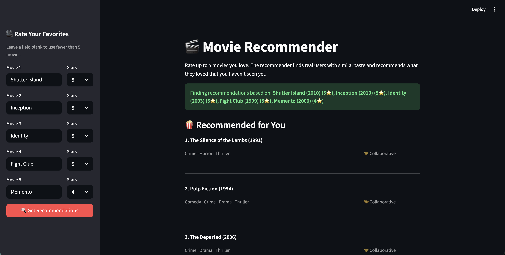

# 🎬 Movie Recommender System

A content-based + collaborative filtering movie recommender built with Python and Streamlit.
Rate up to 5 movies you love, and the app finds real users with similar taste from 100,000
ratings to recommend what they enjoyed that you haven't seen yet.

> **Note:** This project was built with the help of AI pair programming (Claude by Anthropic).
> All code has been reviewed, tested, and understood by the author. Using AI tools to
> accelerate learning and development is an intentional part of my workflow.

**[🚀 Live Demo](https://huggingface.co/spaces/Iris-Lian/movie-recommender)**



---

## How It Works

The recommender uses a two-stage hybrid approach:

**Stage 1 — User-Based Collaborative Filtering (primary)**
Your star ratings are compared against 671 real users in the MovieLens dataset.
The 20 most similar users (your "taste neighbors") are found using cosine similarity.
Movies they rated highly that you haven't seen are ranked by a weighted score.

**Stage 2 — Content-Based Fallback**
For movies with insufficient rating data, a TF-IDF genre similarity model (enriched
with average rating and popularity) fills the remaining slots.

Each result is labeled so you can see which engine produced it.

```
You rate 5 movies (1–5 ⭐)
        │
        ▼
Find 20 real users with similar taste
        │
        ▼
Aggregate their highly-rated unseen movies
        │
        ├── Enough CF signal? → Collaborative result 🤝
        └── Not enough?       → Genre match fallback 🏷️
        │
        ▼
Top 10 recommendations
```

---

## Tech Stack

| Tool | Purpose |
|---|---|
| Python 3.11 | Core language |
| Streamlit | Web UI |
| scikit-surprise | SVD model training (data prep) |
| scikit-learn | TF-IDF vectorizer + cosine similarity |
| pandas / numpy | Data processing |
| scipy | Sparse matrix storage |
| rapidfuzz | Fuzzy movie title matching |

---

## Dataset

[MovieLens Small Dataset](https://www.kaggle.com/datasets/shubhammehta21/movie-lens-small-latest-dataset) via Kaggle

- 9,742 movies
- 100,836 ratings
- 671 users
- Ratings scale: 0.5 – 5.0 ⭐

> The dataset is **not included** in this repository due to licensing.
> Please download it yourself from the Kaggle link above (free account required).

---

## Run Locally

**1. Clone the repo**
```bash
git clone https://github.com/Iris-Lian/movie-recommender.git
cd movie-recommender
```

**2. Create a virtual environment**
```bash
python -m venv venv

# macOS/Linux:
source venv/bin/activate

# Windows:
venv\Scripts\activate
```

**3. Install dependencies**
```bash
pip install -r requirements.txt
```

**4. Download the dataset**

Download from [Kaggle](https://www.kaggle.com/datasets/shubhammehta21/movie-lens-small-latest-dataset)
and place `movies.csv` and `ratings.csv` in the `data/` folder.

**5. Run the data preparation notebook**

Open `notebooks/prepare_recommender.ipynb` and run all cells.
This generates the model artifacts in `src/` and only needs to be run once.

**6. Launch the app**
```bash
streamlit run app.py
```

Open your browser at `http://localhost:8501`.

---

## Project Structure

```
movie-recommender/
├── data/                         # Place dataset CSV files here (not in repo)
│   ├── movies.csv
│   └── ratings.csv
├── src/                          # Precomputed model artifacts
│   ├── movies.pkl
│   ├── svd_model.pkl
│   └── tfidf_matrix.npz
├── notebooks/
│   └── prepare_recommender.ipynb # Run once to generate src/ artifacts
├── app.py                        # Streamlit app
├── requirements.txt
├── packages.txt
└── README.md
```

---

## Example Results

**Input:** Shutter Island (5⭐), Inception (5⭐), Identity (5⭐), Fight Club (5⭐), Memento (4⭐)

| # | Movie | Source |
|---|---|---|
| 1 | The Silence of the Lambs (1991) | 🤝 Collaborative |
| 2 | Pulp Fiction (1994) | 🤝 Collaborative |
| 3 | The Departed (2006) | 🤝 Collaborative |
| 4 | The Lord of the Rings: The Return of the King (2003) | 🤝 Collaborative |
| 5 | Seven (a.k.a. Se7en) (1995) | 🤝 Collaborative |
| 6 | The Shawshank Redemption (1994) | 🤝 Collaborative |
| 7 | The Dark Knight (2008) | 🤝 Collaborative |
| 8 | The Usual Suspects (1995) | 🤝 Collaborative |
| 9 | The Lord of the Rings: The Fellowship of the Ring (2001) | 🤝 Collaborative |
| 10 | The Lord of the Rings: The Two Towers (2002) | 🤝 Collaborative |

**Input:** The Departed (5⭐), The Lord of the Rings: The Return of the King (5⭐), Fargo (4⭐), Burn After Reading (2⭐), No Country for Old Men (4⭐)

| # | Movie | Source |
|---|---|---|
| 1 | The Matrix (1999) | 🤝 Collaborative |
| 2 | Star Wars: Episode V - The Empire Strikes Back (1980) | 🤝 Collaborative |
| 3 | Star Wars: Episode IV - A New Hope (1977) | 🤝 Collaborative |
| 4 | Pulp Fiction (1994) | 🤝 Collaborative |
| 5 | The Godfather (1972) | 🤝 Collaborative |
| 6 | Fight Club (1999) | 🤝 Collaborative |
| 7 | The Shawshank Redemption (1994) | 🤝 Collaborative |
| 8 | Star Wars: Episode VI - Return of the Jedi (1983) | 🤝 Collaborative |
| 9 | Saving Private Ryan (1998) | 🤝 Collaborative |
| 10 | American Beauty (1999) | 🤝 Collaborative |

---

## What I Learned

- How collaborative filtering works and why cold-start is a hard problem
- The difference between user-based and item-based CF
- Why SVD with a fake user ID doesn't personalize (global bias only)
- How to combine content-based and collaborative signals in a hybrid system
- Streamlit state management, caching, and deployment to Hugging Face Spaces
- Practical data issues: sparse matrices, dataset conventions (MovieLens title format), fuzzy matching

---

## Acknowledgements

- [MovieLens](https://grouplens.org/datasets/movielens/) by GroupLens Research
- [scikit-surprise](https://surpriselib.com/) for the recommendation library
- [Streamlit](https://streamlit.io/) for the UI framework
- [Claude](https://claude.ai) by Anthropic for AI pair programming assistance
